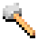

# blender-pixelart
Blender templates to render pixelart.

Supported blender versions: 2.8x

Renderer: Eevee

### Basics of rendering

 * Copy a template you need, so that you have an empty one when you need another.
 * Add a model:
    * File > Import
    * Paste from another blender instance
    * Model yourself
 * When you are satisfied with position, rotation and scale in the camera view, hit F12 to render and then Alt+S to save the image when it's ready.
 * Settings to tweak when results are not satisfying:
    * Render Properties > Film > Filter Size
    * World Properties > Surface
    * Freestyle (you can have different styles at least per model)
    * Node groups inputs in compositing
 * When some part of the model is not sized appropriately, try either moving it a bit considering the grid on the camera so that it takes more or less space in certain output pixels or even separating a thin part and adding a Solidify modifier to make it thicker.
 * Due to camera angle, Z rotation of the model that makes it diagonally placed in the render is not 45° but somewhere around 36°.
 * The easiest way to disable a node group in compositing is muting it with M keyboard shortcut.

### Credits

FakeReduceBits node group by aliasguru https://blender.stackexchange.com/a/90949

Originally developed for filling UltiCa tileset for Cataclysm Dark Days Ahead https://github.com/I-am-Erk/CDDA-Tilesets/

Used hammer model by hdvdeargentina https://sketchfab.com/3d-models/free-tools-bfc817e59a5f496b9a0a6e4ec1d5a32d

Please consider crediting this project when you release rendered images.